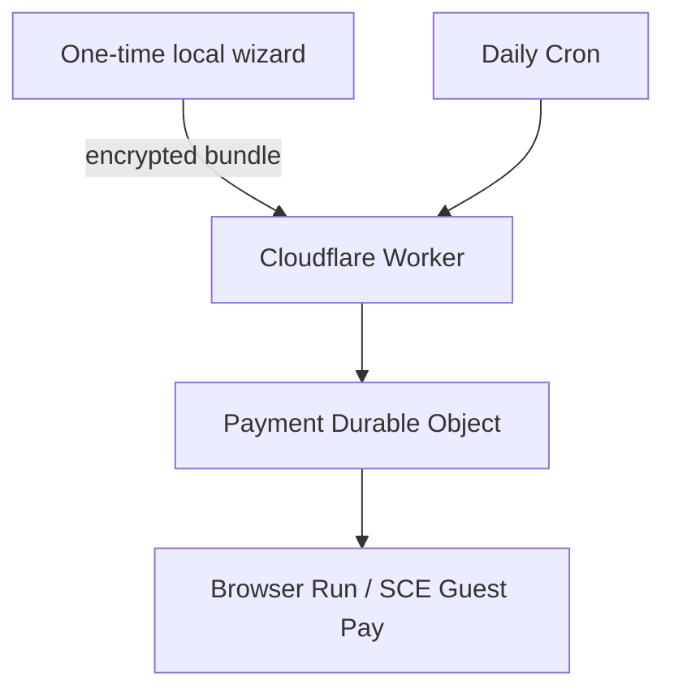

# Architecture

## Goal

Run a low-frequency SCE Guest Pay browser workflow without making a laptop part
of the production system. The design favors a visible stop over an uncertain
payment.

## Components

| Component | Responsibility |
|---|---|
| Local wizard | Human-reviewed guest flow, tokenized storage capture, origin approval, policy prompts, encryption, deployment, cloud dry run |
| Worker | Bearer-authenticated control API, Cron entrypoint, routing to the single account object |
| Durable Object | Strong run serialization, encrypted bundle storage, arming, payment intents, bill-cycle idempotency, reconciliation |
| Browser Run adapter | Restore tokenized state, enter guest account details, read the bill, select the saved/tokenized method, verify review, submit |
| Policy engine | Bill ceiling, due window, last-four binding, fee ceiling, review arithmetic |

## Why Cloudflare

Cloudflare Browser Run supports Playwright inside Workers, Cron Triggers invoke a
Worker on a schedule, and Durable Objects provide a strongly consistent
coordination boundary. No always-on server or workstation scheduler is needed.

The deployment uses:

- `@cloudflare/playwright`;
- a Browser Run binding named `BROWSER`;
- one SQLite-backed Durable Object class named `PaymentAccount`;
- a daily `0 17 * * *` UTC Cron; and
- Worker secrets `BUNDLE_KEY` and `ADMIN_TOKEN`.

## Onboarding data path

The local browser is the only place where the user enters card fields. At the
final review, the wizard captures browser storage state, per-origin session
storage, navigation origins, and frame origins. It then asks separately for
guest account identifiers and deterministic payment limits.

The complete bundle is encrypted locally with a fresh 256-bit AES-GCM key. Only
ciphertext is uploaded to the Durable Object. The key is installed as a
non-readable Worker secret. The local control file contains only the deployed
URL and administrator token.

## Run sequence

1. Cron requests a real run from the account Durable Object.
2. The object rejects a concurrent lease or unresolved intent.
3. It decrypts and validates the guest bundle.
4. Browser Run restores captured browser state and enters the account number and
   mailing ZIP in Guest Pay.
5. The adapter reads amount due and due date.
6. The policy engine checks amount and due window.
7. A bill fingerprint checks the confirmed-payment index.
8. The adapter selects the tokenized method and reaches review.
9. Policy verifies account reference, amount, due date, last four, fee under
   $4, and total arithmetic.
10. The object persists a `submitting` intent.
11. The adapter activates the exact final-payment control once.
12. A recognized SCE confirmation changes the intent to `confirmed`.

Any exception after step 10 changes the intent to `unknown`. That state blocks
all automatic runs until manual reconciliation.

## State

The Durable Object stores:

- the encrypted onboarding bundle;
- `configured` and `armed` flags;
- a short run lease;
- payment intents;
- a confirmed fingerprint index;
- the latest sanitized run record.

It does not store plaintext account identifiers, raw card data, browser
screenshots, page HTML, or request/response payloads.
