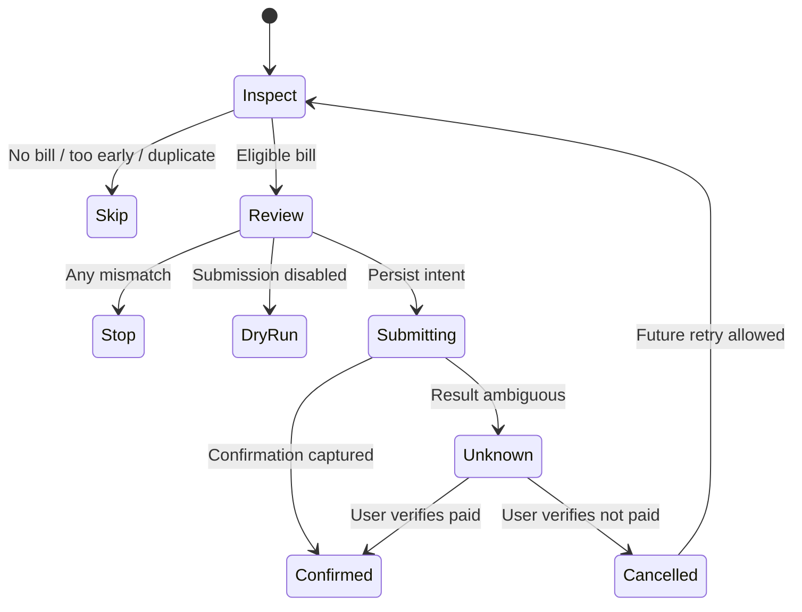

# Architecture

## Design goal

The project automates a narrow action—pay the full current SCE bill with a
previously saved card—without becoming a credential vault or a generic payment
bot. Correct behavior under uncertainty is more important than finishing a run.

## Components

| Component | Responsibility |
|---|---|
| CLI | Setup, explicit authorization, dry run, run, status, reconciliation, scheduler control |
| Playwright portal adapter | Dedicated browser profile, semantic UI discovery, current SCE payment-route navigation, confirmation parsing |
| Workflow | Due window, amount cap, fee arithmetic, account/card binding, idempotency, submission boundary |
| State store | Atomic local JSON state for runs and payment intents |
| Audit log | Append-only redacted operational events |
| Scheduler | User-level launchd or systemd timer at 9:00 a.m. daily |
| Desktop notifications | Best-effort success and attention notices |

## Current payment target

The adapter enters at
`https://www.sce.com/mysce/billsnpayments/paybills`. Before final submission,
the top-level page must stay on `www.sce.com` and at that path (or one of its
subroutes). Query strings and fragments are allowed; unrelated SCE paths,
popups, and every external payment-portal hostname fail closed.

This route contract is intentionally independent of the underlying card
processor. A future redirect is treated as a site change, not automatically
learned or added to the allowlist. Updating the target requires a code review,
new deterministic fixtures, and a successful headed dry run.

## Payment state machine



The durable intent is written by a callback after the portal has found an
unambiguous final control and immediately before that control is activated.
Failures before the callback are safe to retry. Failures after it are ambiguous
and block every future submission.

## Idempotency

The bill-cycle fingerprint is:

```text
SHA-256("sce-pay-intent-v1" + accountReference + dueDate + amountCents)
```

`accountReference` is itself an irreversible truncated hash of the configured
account label or masked account identifier. Raw SCE account numbers are not
written to state or audit files.

A confirmed matching fingerprint is skipped. An `unknown` or `submitting`
intent blocks all payments, even if a newly observed fingerprint differs. This
global block is intentional: a user must establish what happened before the
agent can safely move money again.

## Live portal adapter

Selectors are ordered from semantic and stable to heuristic:

1. Accessible roles and names documented by SCE, such as **Pay by Card**, **Continue**, and **Confirm Payment**.
2. Associated form labels for payment amount and saved methods.
3. Text extraction scoped to labels such as **Current Amount Due**,
   **Convenience Fee**, and **Total Payment**.

The adapter reads same-origin and embedded frames but does not inject scripts,
call private APIs, reverse engineer bundled code, or bypass challenges.

Before continuing across a navigation, the adapter requires HTTPS and a host
matching `allowedHosts`. Wildcards match subdomains only, not lookalike suffixes.

## Extension points

Keep provider-specific behavior behind `PortalClient`. A future supported SCE
API or a different browser layout can implement:

```ts
type PortalClient = {
  inspectBill(): Promise<BillSnapshot | null>;
  preparePayment(
    bill: BillSnapshot,
    paymentMethodLast4: string,
  ): Promise<PaymentReview>;
  submitPayment(
    onWillSubmit: () => Promise<void>,
  ): Promise<PaymentConfirmation>;
  close(): Promise<void>;
};
```

Do not move amount, fee, duplicate, or ambiguous-result decisions into a portal
adapter. Those invariants belong to the deterministic workflow.
