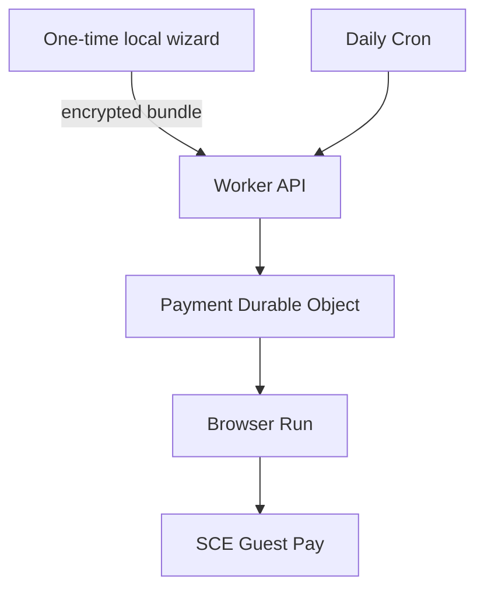

# Architecture

## Goal

Run a low-frequency SCE Guest Pay workflow in Cloudflare without making a
workstation part of production. Prefer a visible stop to a duplicate or
misdirected payment.

## Components

| Component | Responsibility |
|---|---|
| Local wizard | Preflight, human-reviewed Guest Pay capture, payment-method proof, page/frame/request origin approval, encryption, atomic secret deployment, cloud dry run |
| Worker | Constant-time bearer authentication, request limits, security headers, health/readiness, Cron entrypoint |
| Durable Object | Configuration/release arming, run lease, adaptive check schedule, payment intents, duplicate index, reconciliation, bounded run history |
| Browser adapter | Restore and refresh tokenized state, enforce route/network contract, inspect bill, prepare review, activate one final control |
| Policy engine | Observation freshness, plausible bill cycle, full balance, bill ceiling, due window, card ending, fee ceiling, arithmetic |

## Cloudflare bindings

- `BROWSER`: Browser Run / Playwright
- `PAYMENT_ACCOUNT`: SQLite-backed `PaymentAccount` Durable Object
- `CF_VERSION_METADATA`: immutable current Worker version identity
- `BUNDLE_KEY`: AES-256-GCM key, deployed as a Worker secret
- `ADMIN_TOKEN`: control API bearer token, deployed as a Worker secret
- Cron: `0 17 * * *` UTC

Code and secrets are uploaded in one Worker deployment. The arm record stores
the current version ID and configuration ID. A later deploy therefore fails
closed as `release-changed` until the new version passes a cloud dry run and is
armed.

## Data path

The local browser is the only place raw card fields are entered. At final review
the wizard reads only the masked card ending, captures Playwright storage state
and per-origin session storage, and records observed HTTPS origins. The bundle
is encrypted locally using AES-256-GCM with authenticated context and a
SHA-256-derived bundle ID. Durable Object storage receives only the envelope.

After a safe cloud run, the adapter captures refreshed cookies, local storage,
IndexedDB, and session storage. The Worker validates size and structure,
re-encrypts with the Worker secret, and atomically replaces the ciphertext while
preserving the stable configuration ID.

## Scheduled execution

Cron wakes daily, but the Durable Object stores `nextCheckAt`:

- confirmed payment: check again in 14 days;
- no balance or already-confirmed bill: check again in 7 days;
- bill not due: resume exactly when the configured due window opens;
- safe pre-submission failure: retry on the next daily Cron; and
- uncertain post-submission result: do not retry.

Deferred wakes do not launch a browser.

## Payment sequence

1. Load and authenticate the encrypted bundle.
2. Require the exact configuration/release arm record.
3. Reject a not-yet-due browser check, active lease, or unresolved intent.
4. Launch Browser Run with service workers blocked and an exact request
   allowlist.
5. Enter SCE account number and ZIP through Guest Pay.
6. Read a fresh, plausible bill and due date.
7. Reject a confirmed fingerprint for the same account, due date, and amount.
8. Select the tokenized card and reach review.
9. Parse the displayed card ending and require unambiguous amount, fee, total,
   date, origin, and route evidence.
10. Immediately re-read the review.
11. Renew the exclusive lease and atomically write `submitting`.
12. Activate exactly one enabled final-payment control.
13. Require a recognizable success and confirmation identifier.
14. Atomically mark the intent `confirmed` and index its fingerprint.

Crashes after step 11 leave a blocking `submitting` intent. Exceptions after
the click leave `unknown`. Neither is automatically retried.

## Durable state

- encrypted bundle and stable configuration identity;
- current dry-run attestation and release-bound arm record;
- active run lease;
- next browser-check time;
- payment intents and confirmed fingerprints;
- last run and the newest 100 sanitized run records.

No raw card fields, password, screenshot, HTML, network payload, account number,
ZIP, or browser token appears in status, notifications, or logs.
